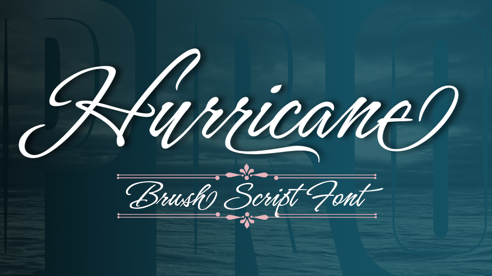

# Hurricane

A storm has been brewing. It’s Hurricane. Flair and excitement abounds with this fast moving spirited brush script. This updated version of Hurricane was created with high end advertising in mind but can also be used for designs outside of commercial uses— greeting cards and social expression, or even scrap-booking projects. 

There are three regular styles incorporated into the PRO version of the this font, plus graphics to add an extra breeze to your work. The base font is straight forward with more Roman capital forms. The Script stylistic set swaps the caps out for the more flourished uppercase.



## Building the Fonts

The font is built using fontmake and gftools post processing script. Tools are all python based, so it must be previously installed.

To install all the Python tools into a virtualenv, do the following:

From terminal:

```

cd your/local/project/directory

#once in the project folder create a virtual environment. 
This step has to be done just once, the first time:

python3 -m venv venv

#activate the virtual environment

source venv/bin/activate

#install the required dependencies

pip install -r requirements.txt

```

Then run the this command:

```
cd sources
gftools builder config.yml
```
